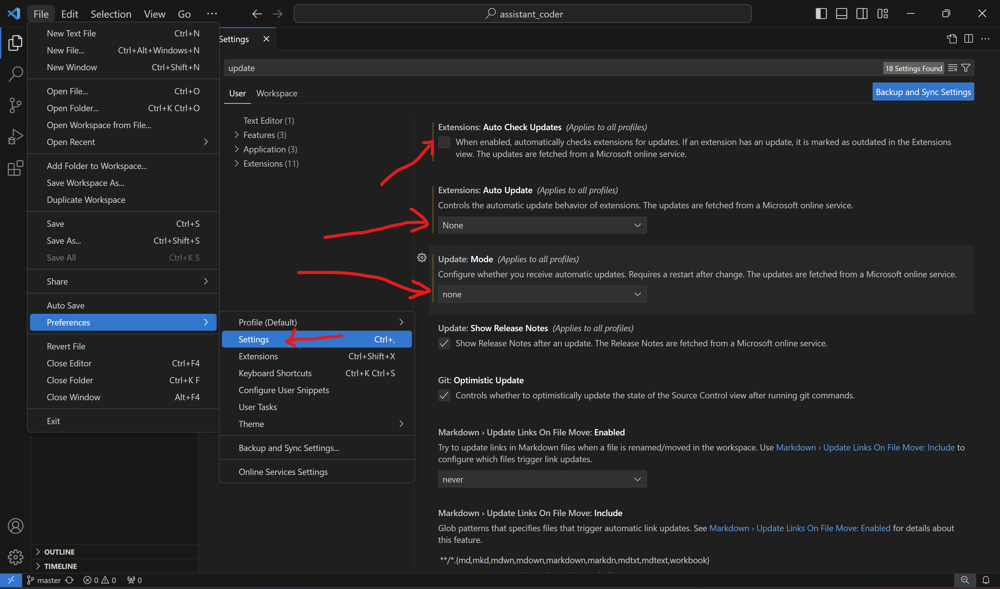
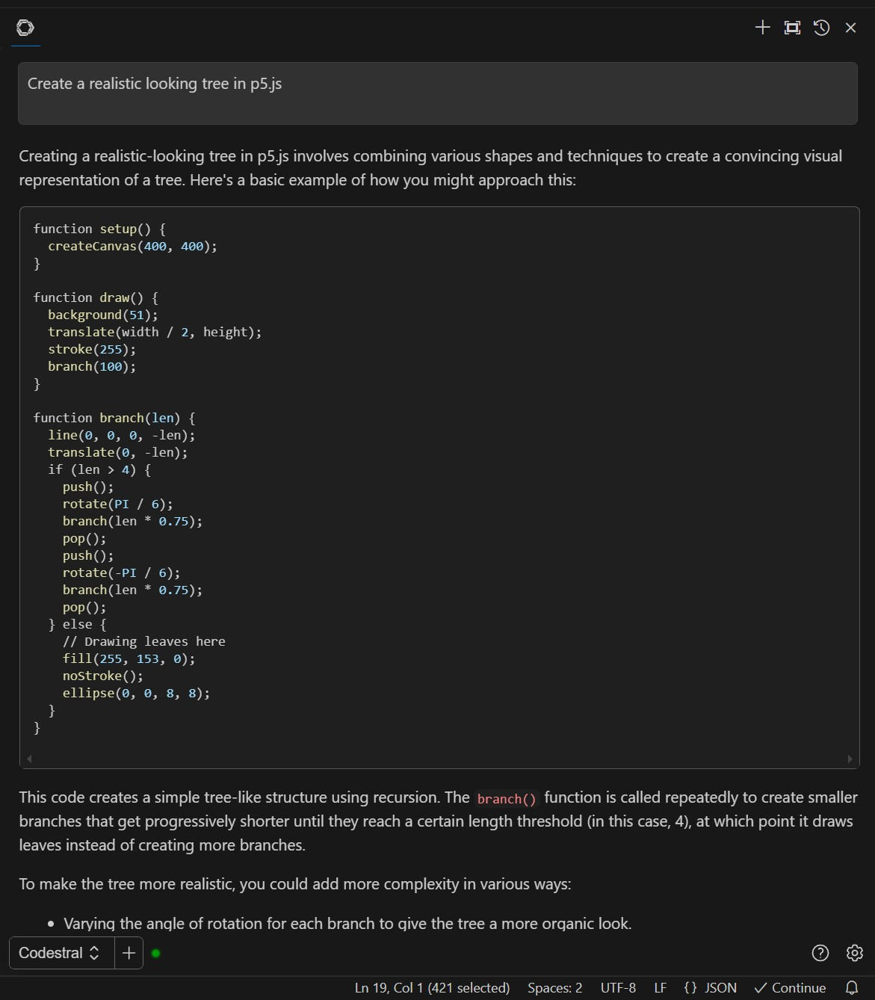
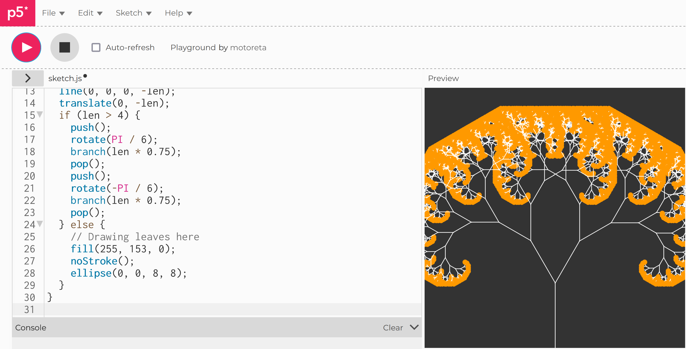
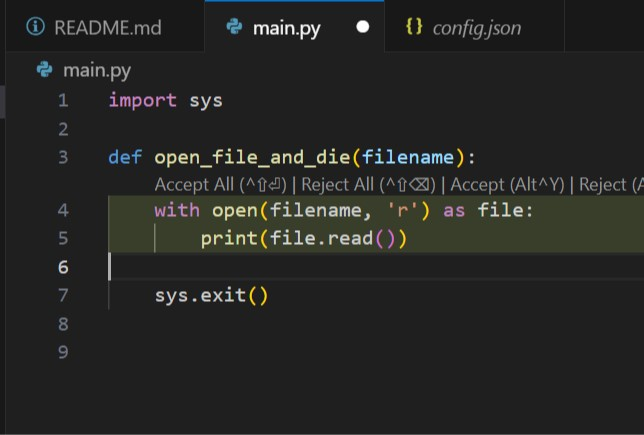
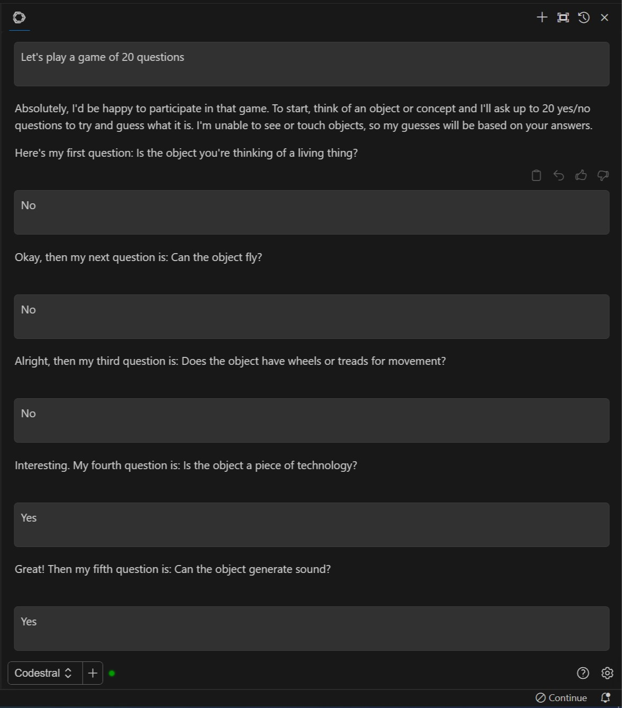
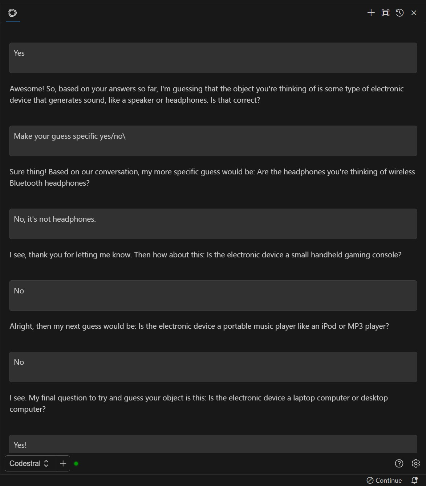
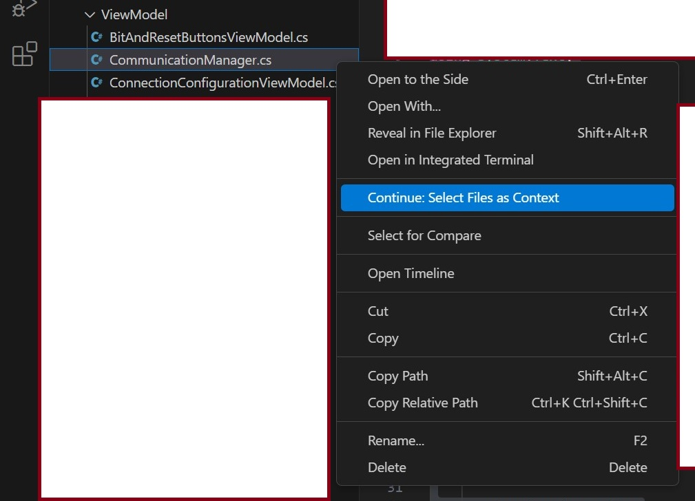
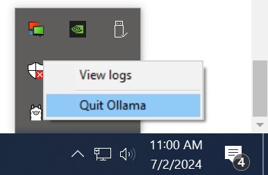
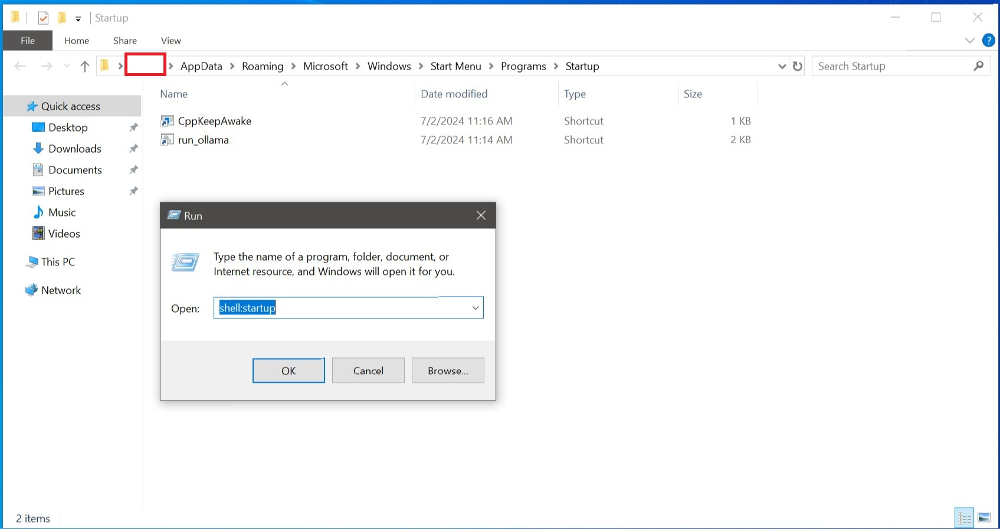

# Local Offline `GitHub Copilot` alternative

## Technology Stack

* Continue.dev Visual Studio Code extension for chat and autocomplete

* Ollama to run the model on GPU / CPU (tested with Nvidia RTX A5000 GPU with 24 GB VRAM, no integrated graphics card), and provide a network API to serve the Continue.dev client.

* 4-bit quantized (Q4_0) 11.7 gigabyte version of Codestral 22.2 billion parameters by the French🥐 company Mistral AI, that can run fully on a GPU with 24GB of VRAM without any help from the CPU.

* Tested on Windows 10 x86_64 Build 1903 operating system

## Client Setup (end users)

1. You have to install VS Code that is either this version `VSCodeUserSetup-x64-1.90.2.exe` or newer on any client computer on the internal network that will use the AI services. You can download from https://update.code.visualstudio.com/1.90.2/win32-x64-user/stable which is a version of VS Code that supports the provided version of the `Continue`.

2. Disable VS Code auto update and disable auto update or extensions (you don't want your setup to suddenly break)



3. Any client will need the `Continue` VS Code extension for your operating system + CPU architecture. Use the pre-downloaded version `continue-win32-x64-0.8.40.vsix` which you can download from: https://github.com/continuedev/continue/releases/tag/v0.8.40-vscode (scroll all the way down to `Assets`. The .vsix file can then be installed globally as an extension in VS Code as if you installed the extension from the internet (Extensions tab -> ... -> `install from vsix`).

4. Drag the newly added extension tab to the right like it asked you

5. In the welcome page: `Welcome to Continue` choose `Local models` and click `Continue`. Ignore the `Failed to connect` error that then keeps popping up

6. Click `Continue` again

7. Click the `Configure` gear icon ⚙ in the bottom right of the `Continue` extension window. That will open a `config.json` for you to edit.

8. Change it to look like this (replace 127.0.0.1 IP with the actual server's IP)
```json
{
  "models": [
    {
      "title": "Codestral",
      "provider": "ollama",
      "model": "codestral:22b",
      "apiBase": "http://127.0.0.1:11434/",
      "systemMessage": "Do exactly as the user says / means",
      "contextLength": 32000
    }
  ],
  "tabAutocompleteOptions": {
    "disable": true
  },
  "allowAnonymousTelemetry": false
}
```

If you're using `La Plateforme` because you don't have enough VRAM (or because of license issues), this is the correct json configuration (replace with your real API key):

```json
{
  "models": [
    {
      "title": "Codestral",
      "model": "codestral-latest",
      "contextLength": 32000,
      "apiKey": "tVXXXXXXXXXXXXXXXXXXXXXXXXXXXXXX",
      "provider": "mistral"
    }
  ],
  "tabAutocompleteOptions": {
    "disable": true
  },
  "allowAnonymousTelemetry": false
}
```

9. Save the json file, and then reload VS Code window. Now you should be able to chat with `Continue` in its extension window (as long as the server is running on the internal network).

## Client Usage

1. Open VS Code in a specific project, and press F1 key on your keyboard. That should open VS Code's command palette. Start typing: `Continue: ` to see the options of what the AI can do for you while you're programming your code.

2. Select any length of text / code.

3. Run VS Code command (F1 -> type) `Continue: Add Highlighted Code to Context`, then type your prompt to ask the AI.

4. Example chat with the chat interface:





5. Ingest huge prompts, up to 32,000 tokens (400+ line readme within seconds).

6. Do some code completion by pressing CTRL+i at any moment while writing code. It'll add code where your cursor currently is. It'll ask you for instructions. The simplest instructions you can give it is: `complete here`.



7. Multi-turn conversations- Codestral keeps the context alive better than any LLM I know- it managed to win in the game of 20 questions!





8. Select files as context



9. Generate working UML syntax. Ask it to generate PlantUML (planttext.com) syntax

## Server Setup
I installed `OllamaSetup.exe` for Windows on an online Windows 11 computer after I downloaded it from https://github.com/ollama/ollama/releases/tag/v0.1.48

I ran the command: `ollama pull codestral:22b` to download https://ollama.com/library/codestral which is 12 GB in size (it's quantized). It downloads into `C:/Users/YOUR_USERNAME/.ollama` folder

I then followed this guide https://ollama/blog/continue-code-assistant which essentially says that the command to run the server is: `ollama run codestral:22b`.

That however will only run on localhost, so instead, just run this batch file [Run Ollama](./run_ollama.bat).

When `Continue` requests to use the model, it'll automatically be loaded.

Of course, you have to install ollama on the offline computer, and copy the pulled model from the `.ollama` folder in the online computer to `C:/Users/YOUR_USERNAME/.ollama` folder in the offline computer (and create it if it doesn't exist).

Before deleting all of the existing files in the .ollama folder on your offline computer, stop Ollama from running:



You should be able to process long context lengths within 10 seconds (like, an entire readme of a large project). If you can't: shut down ollama from the system tray, close all apps (or restart PC), and launch it again. You need to make sure that you launch it when you have enough VRAM available so that the entire model gets loaded into the GPU.

If some of the model gets into the CPU, that hurts prompt ingestion speed 40x (not sure if this is true, it might sometimes just get stuck for now reason until restarting Ollama).

Disable `ollama.exe` from running on startup (in Windows Task Manager `startup items` tab), so that we can have our batch file run on user login instead.



## Known Issues

* Only 1 prompt at a single time (more an issue of insufficient hardware)- That's what https://github.com/BigBIueWhale/ollama_load_balancer is for.

* Sometimes gets loaded automatically into CPU when the GPU memory is too full

* When chatting, the cancel doesn't always cancel (it maybe actually never). That means that if the LLM wants to give you a long response, you'll have to wait a while until you can ask again (or you can kill Ollama and start it again).
